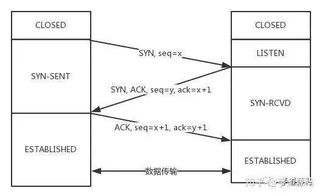
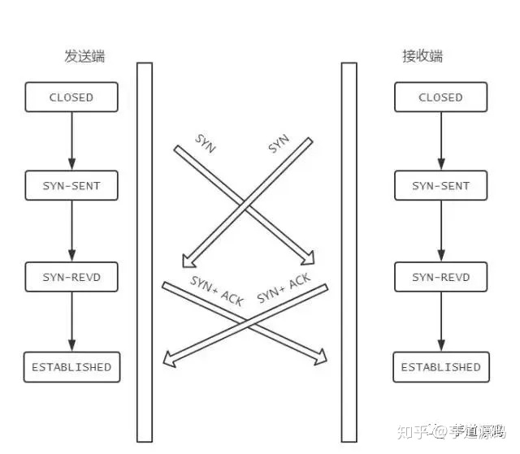

# TCP UDP
- 参考链接:

[TCP UPD面试灵魂10问](https://zhuanlan.zhihu.com/p/161970400)

## 1.能不能说一说 TCP 和 UDP 的区别？

首先概括一下基本的区别:

TCP是一个**面向连接的、可靠的、基于字节流**的传输层协议。

而UDP是一个**面向无连接**的传输层协议。(就这么简单，其它TCP的特性也就没有了)。
具体来分析，和 UDP 相比，TCP 有三大核心特性:

- 面向连接。所谓的连接，指的是客户端和服务器的连接，在双方互相通信之前，TCP 需要三次握手建立连接，而 UDP 没有相应建立连接的过程。

- 可靠性。TCP 花了非常多的功夫保证连接的可靠，这个可靠性体现在哪些方面呢？一个是有状态，另一个是可控制。

TCP 会精准记录哪些数据发送了，哪些数据被对方接收了，哪些没有被接收到，而且保证数据包按序到达，不允许半点差错。这是有状态。

当意识到丢包了或者网络环境不佳，TCP 会根据具体情况调整自己的行为，控制自己的发送速度或者重发。这是可控制。

相应的，UDP 就是无状态, 不可控的。

- 面向字节流。UDP 的数据传输是基于数据报的，这是因为仅仅只是继承了 IP 层的特性，而 TCP 为了维护状态，将一个个 IP 包变成了字节流。

## 2.说说TCP三次握手的过程？为什么是三次而不是两次、四次？
### 握手过程

从最开始双方都处于CLOSED状态。然后服务端开始监听某个端口，进入了LISTEN状态。

然后客户端主动发起连接，发送 SYN , 自己变成了SYN-SENT状态。

服务端接收到，返回SYN和ACK(对应客户端发来的SYN)，自己变成了SYN-REVD。

之后客户端再发送ACK给服务端，自己变成了ESTABLISHED状态；服务端收到ACK之后，也变成了ESTABLISHED状态。

另外需要提醒你注意的是，从图中可以看出，SYN 是需要消耗一个序列号的，下次发送对应的 ACK 序列号要加1，为什么呢？只需要记住一个规则:

“凡是需要对端确认的，一定消耗TCP报文的序列号。
SYN 需要对端的确认， 而 ACK 并不需要，因此 SYN 消耗一个序列号而 ACK 不需要。

### 为什么不是两次？
根本原因: 无法确认客户端的接收能力。

分析如下:

如果是两次，你现在发了 SYN 报文想握手，但是这个包滞留在了当前的网络中迟迟没有到达，TCP 以为这是丢了包，于是重传，两次握手建立好了连接。

看似没有问题，但是连接关闭后，如果这个滞留在网路中的包到达了服务端呢？这时候由于是两次握手，服务端只要接收到然后发送相应的数据包，就默认建立连接，但是现在客户端已经断开了。

看到问题的吧，这就带来了连接资源的浪费。

### 为什么不是四次？
三次握手的目的是确认双方发送和接收的能力，那四次握手可以嘛？

当然可以，100 次都可以。但为了解决问题，三次就足够了，再多用处就不大了。

### 三次握手过程中可以携带数据么？
第三次握手的时候，可以携带。前两次握手不能携带数据。

如果前两次握手能够携带数据，那么一旦有人想攻击服务器，那么他只需要在第一次握手中的 SYN 报文中放大量数据，那么服务器势必会消耗更多的时间和内存空间去处理这些数据，增大了服务器被攻击的风险。

第三次握手的时候，客户端已经处于ESTABLISHED状态，并且已经能够确认服务器的接收、发送能力正常，这个时候相对安全了，可以携带数据。

###  同时打开会怎样？
如果双方同时发 SYN报文，状态变化会是怎样的呢？

这是一个可能会发生的情况。

状态变迁如下:

在发送方给接收方发SYN报文的同时，接收方也给发送方发SYN报文，两个人刚上了!

发完SYN，两者的状态都变为SYN-SENT。

在各自收到对方的SYN后，两者状态都变为SYN-REVD。

接着会回复对应的ACK + SYN，这个报文在对方接收之后，两者状态一起变为ESTABLISHED。

这就是同时打开情况下的状态变迁。

## 3.说说 TCP 四次挥手的过程
## 过程拆解

刚开始双方处于ESTABLISHED状态。

客户端要断开了，向服务器发送 FIN 报文，在 TCP 报文中的位置如下图:

